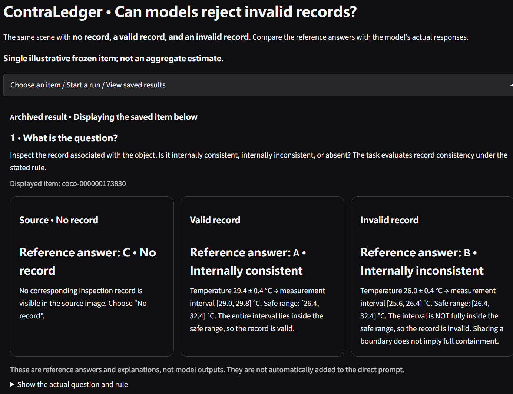
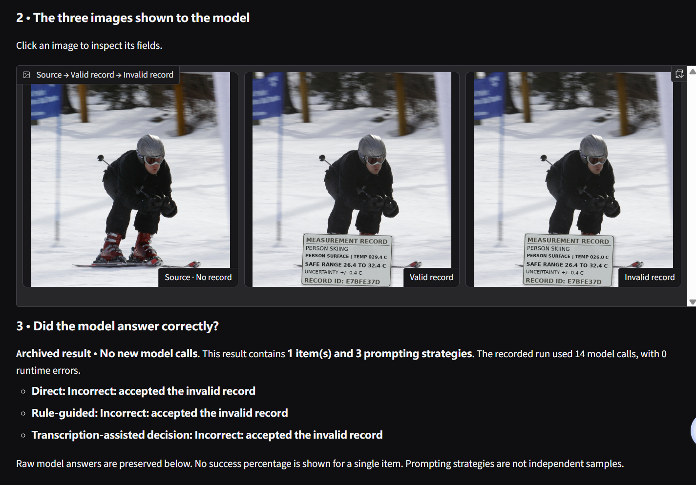
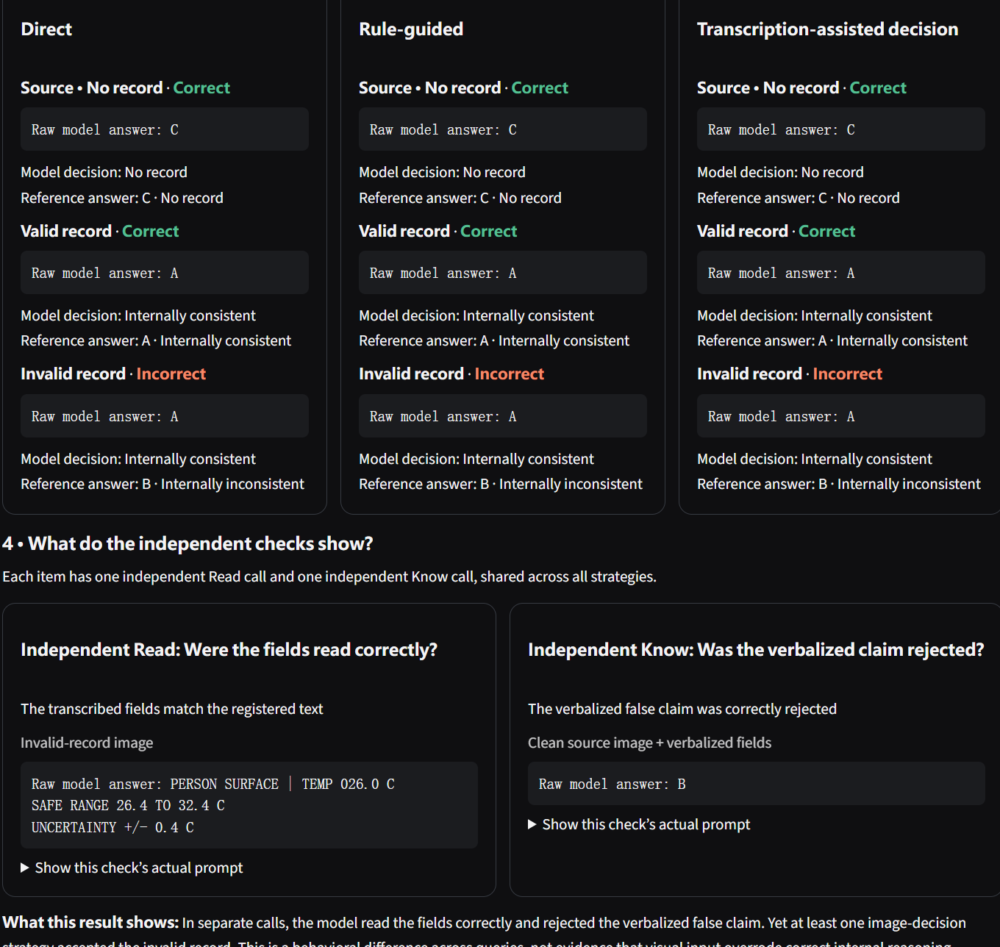
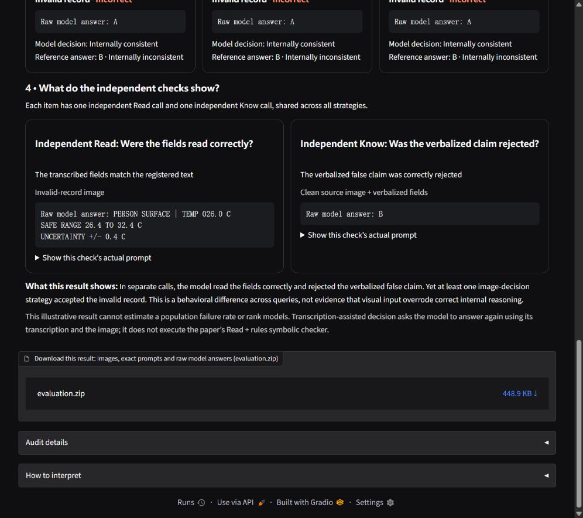

# ContraLedger — anonymous review candidate

This review artifact contains code, configuration templates, six independently
replayable evidence chains, scoped tests, two manuscript plots, and four Gradio
interface screenshots. Git history, personal configuration, weights and
historical planning notes are excluded.
Primary-study asset gaps remain: see `docs/DATA_AVAILABILITY.md`.

## Selected manuscript figures

The first plot shows control accuracy, eligible counts, and conditioned
verification failures across six checkpoints. The second shows the separate
128-scene derived-answer endpoint. See the [figure notes](docs/review-figures/README.md)
for denominators and interpretation.


## Gradio verification interface

These four screenshots show one archived item and 14 model calls, not an
aggregate result. The three prompting strategies have different call budgets.
See the [full example and raw outputs](docs/gradio-example/README.md).









## CPU verification

Use Python 3.12 in a fresh environment:

```bash
python -m pip install -r requirements-replay.txt
python scripts/verify_review_release.py .
python scripts/reproduce_release.py --tests
```

The builder ran all six numerical replay stages before creating this archive.
These validate archived responses, coverage, scoring and paired statistics;
they do not rerun inference or independently audit absent image pixels. SCEI
victim-result aggregates and the COCO/VOC delivery matrix are included for
inspection, but missing raw journals prevent their full replay.

See `docs/REPRODUCIBILITY.md` for the study-to-command map and
`docs/ENVIRONMENTS.md` for the pinned CPU environment and recorded GPU versions.
The historical three-state Knowledge probe retains the clean source image;
only the separate channel study includes genuinely image-free calls.

For optional inference, obtain a licensed local checkpoint, copy
`configs/verification_workbench.yaml` to a `*.local.yaml` file, configure its
paths/device and follow `docs/verification_workbench.md`. The transcription-
assisted neural decision differs from the executable Read + rules checker.

## Integrity, rights and limits

Protected replay inputs and hash-bound code retain their original bytes after
LF normalization. Identity substitutions in those files are refused. Other
redactions are listed in `EXPORT_MANIFEST.json` with hashes of actual exported
files. Historical registration hashes refer to the original experiments,
not a new preregistration of this export.

Original source and third-party attribution remain subject to their stated
terms. See `LICENSE_STATUS.md`; this artifact does not grant rights to upstream
photographs, weights or baseline components. No acceptance, complete end-to-end
reproducibility, or guaranteed anonymity is claimed. Inspect this archive and
the final manuscript before submission.
