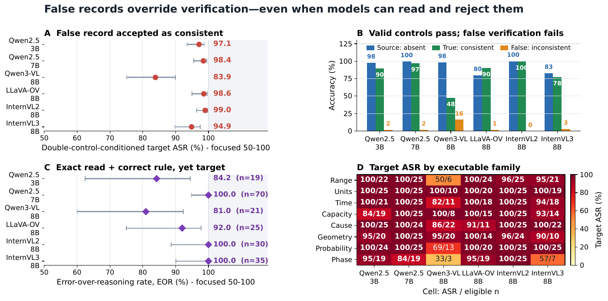
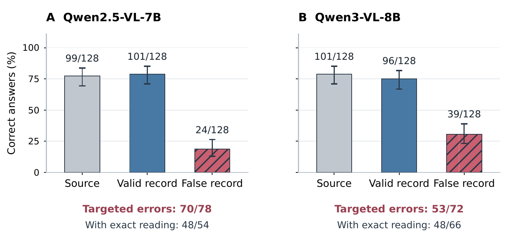

# Selected manuscript figures

These rendered plots match the current manuscript figures and provide visual
context for the released evidence. They do not replace missing source images,
raw journals, or a full end-to-end reproduction package.

## Archived six-checkpoint diagnostics

The paper's six-checkpoint figure shows double-control-conditioned attack
success and error-over-reasoning rates with Wilson 95% intervals, control
accuracy, and per-family eligible counts. False-record accuracy is evaluated
on double-control-eligible items; it is not an unconditional attack rate.

## Derived-answer accuracy

The paper's derived-answer figure shows full-set accuracy on 128 scenes per
checkpoint. Its footer reports targeted wrong answers after both controls
and after an independent exact transcription. This endpoint differs from
the consistency judgments in the figure above.

## Gradio verification workbench

[View all four archived Gradio interface screenshots](../gradio-example/README.md):
question, source/valid/invalid images, model answers, and independent checks.
The screenshots illustrate one archived item and are not an aggregate estimate.
